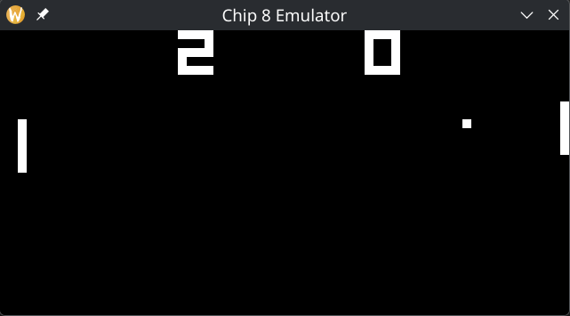
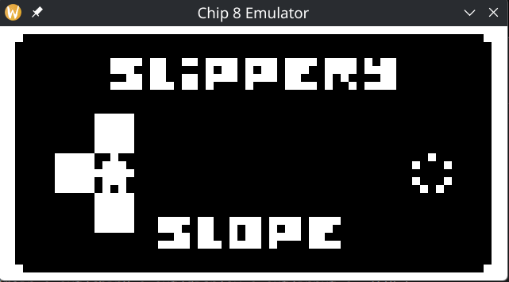

# Chip-8 Emulator (C + SDL2)

A small Chip-8 emulator written in C with SDL2 for video and input.

**Features**
- Core Chip-8 CPU and instruction set
- 64x32 monochrome display with scaling
- Timers at 60 Hz
- Hex keypad mapped to a standard keyboard

**Build**
- Requires SDL2 development headers and libraries

```bash
make
```

**Run**
```bash
./out/chip8 [-v|--verbose] roms/<rom-file>
```
`-v` / `--verbose` dumps CPU state each cycle.

**Keymap**
Chip-8 keypad:
```
1 2 3 C
4 5 6 D
7 8 9 E
A 0 B F
```

Keyboard mapping:
```
1 2 3 4
q w e r
a s d f
z x c v
```

**Screenshots**



**Project Layout**
- `src/chip8.c`: CPU core, opcode decode/execute, timers
- `src/display.c`: SDL window/texture rendering
- `src/input.c`: SDL input handling and key mapping
- `roms/`: Sample ROMs (see `roms/README.md`)

**Known Gaps / TODOs**
- Sound output when `sound_timer` > 0
- Super-CHIP instructions are not implemented (00CN, 00FB, 00FC, 00FD, 00FE, 00FF, etc.)
- No configurable quirk flags (some intepreters treat Load/Store, Shift, Jump, Draw, etc differently)
